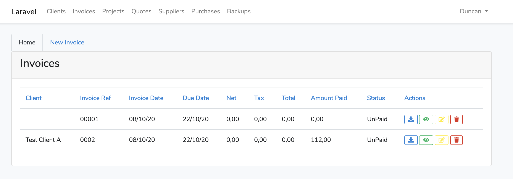

# Laravel ^7.2 Invoice Package

[](//packagist.org/packages/duncanrmorris/invoicemodule)
[](//packagist.org/packages/duncanrmorris/invoicemodule)
[](//packagist.org/packages/duncanrmorris/invoicemodule)
[](//packagist.org/packages/duncanrmorris/invoicemodule)



Welcome to the Invoices package for Laravel ^7.2 which delivers a complete invoicing solution.

This package is designed to be used with other packages from DRMorris IT Services, for more information check out https://github.com/DRMorris-IT-Services

## Installation

To install this package, please follow these instructions

### Step 1

Setup you Laravel application as required, then run
````
composer require duncanrmorris/invoices
````

### Step 2

Once the composer has completed the installation.  You need to register the new Service Provider in the "./config/app.php" file as:

````
'providers' => [

        /*
         * Laravel Framework Service Providers...
         */
        Illuminate\Auth\AuthServiceProvider::class,
        Illuminate\Broadcasting\BroadcastServiceProvider::class,
        Illuminate\Bus\BusServiceProvider::class,
        ///
        duncanrmorris\invoicemodule\InvoicesServiceProvider::class,
````

### Step 3

Then run the database setup

```
php artisan migrate
```

### Step 4
You will now be able to navigate to the new module via:
```
<a href="/invoices">Invoices</a>
```

